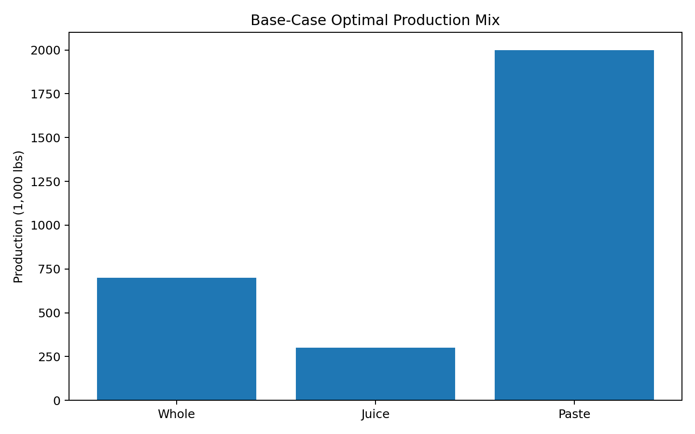
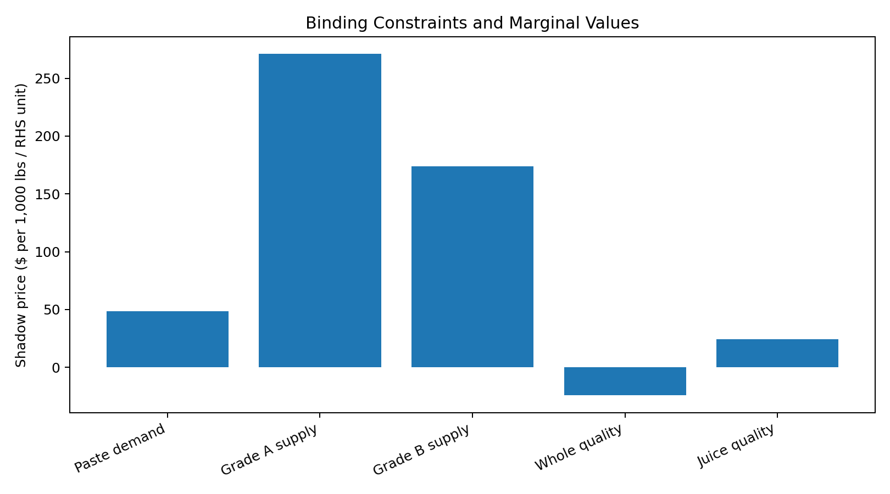
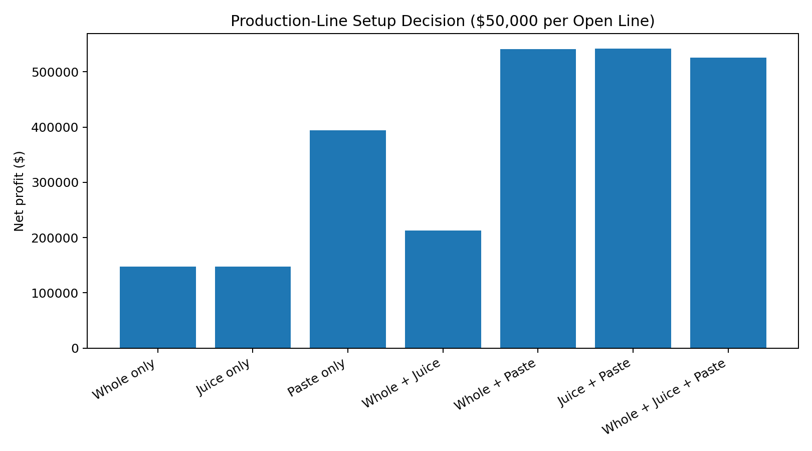
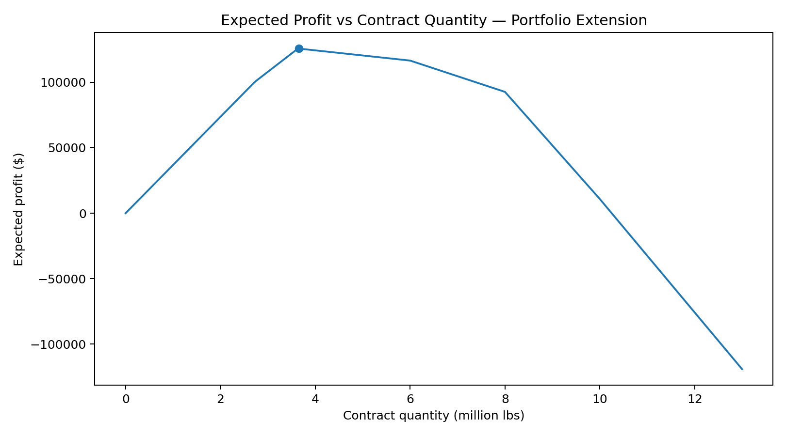
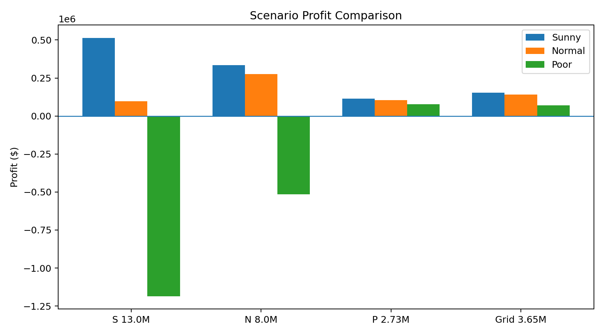

# Production Planning & Supply Contract Optimization with Gurobi

**Linear Programming · Sensitivity Analysis · Fixed-Charge MILP · Scenario Optimization**

This portfolio case study models a food manufacturer's production, purchasing, capacity, line-opening, and raw-material contracting decisions using **Python and Gurobi**.

The project originated as a  graduate optimization workshop. This public repository is a professional portfolio adaptation maintained by **Franbon Ahmed Mohammed**.

> **Copyright note:** the original course case handout is not included or reproduced. The repository contains only the mathematical formulation, derived results from the submitted analysis, and clearly labeled portfolio extensions.

## Business questions

The model supports six management decisions:

1. Which products should be produced, and in what quantities?
2. Is additional high-quality raw material worth buying?
3. Which product's demand is worth increasing through advertising?
4. What is the marginal value of additional lower-quality supply?
5. Which production lines justify a fixed setup cost?
6. How much raw material should be contracted before uncertain quality is known?

## Base LP

The decision variables allocate Grade A and Grade B tomatoes to **whole tomatoes, juice, and paste**. The model maximizes contribution margin subject to:

- product-demand limits,
- Grade A and Grade B supply,
- minimum quality requirements for whole tomatoes and juice.

The saved source result gives an optimal contribution of **$676,069**. Paste is produced at capacity, while Grade A and Grade B supplies are binding. The source sensitivity analysis values Grade A supply at **$271.005 per additional 1,000 lb** and Grade B at **$173.665 per additional 1,000 lb**. fileciteturn48file2L103-L123





## Decision results

| Decision | Recommendation | Source result |
|---|---|---:|
| Base production | Paste at capacity + limited Whole and Juice | $676,069 contribution |
| Extra Grade A | Buy full 80,000 lb at 25.5¢/lb | Objective $677,349.40 |
| Break-even Grade A price | Willing to pay up to about 27.10¢/lb | Shadow-price based |
| Advertising | Increase Paste demand only | Value ≈ $6,041.88 |
| Extra Grade B | Do not buy at 18¢/lb | Marginal value ≈ 17.37¢/lb |
| Fixed setup costs | Open Juice + Paste | Net profit $542,000 |
| Contract under uncertainty | Order ≈ 3.65M lb on tested grid | Expected profit $125,716.47 |

These recommendations are directly supported by the submitted analysis. fileciteturn48file0L20-L38 fileciteturn48file1L67-L92 fileciteturn48file4L167-L196

## Fixed setup cost: from enumeration to MILP

The original assignment checked all seven non-empty combinations of production lines and found that **Juice + Paste** produces the highest net profit at **$542,000**. fileciteturn48file1L81-L92



### Portfolio extension

Because enumeration does not scale, I reformulated the line-opening problem as a **mixed-integer linear program (MILP)** with three binary setup variables and fixed setup costs directly in the objective.

```python
y = {p: m.addVar(vtype=GRB.BINARY, name=f"open_{p}")
     for p in ["whole", "juice", "paste"]}

m.setObjective(
    contribution
    - 50000 * (y["whole"] + y["juice"] + y["paste"]),
    GRB.MAXIMIZE
)
```

This formulation is intended to reproduce the same source decision while demonstrating the scalable fixed-charge modeling pattern.

## Contracting under uncertainty

The source Part 6 uses sunny, normal, and poor crop-quality scenarios with probabilities **25%, 50%, and 25%** and evaluates raw-material orders from 0 to 13 million lb. The original Gurobi code uses a **50,000-lb grid step**. fileciteturn50file0L180-L220

The source report finds the best tested quantity at **3.65 million lb**, with expected profit **$125,716.47**. fileciteturn48file4L182-L190



The expected-profit curve is a **portfolio visualization extension** generated from the same source LP coefficients and scenario probabilities. Its best grid point is **3.65M lb** with expected profit **$125,716.47**, matching the submitted result to rounding.



## Repository structure

```text
red-brand-canners-optimization/
├── README.md
├── PORTFOLIO_NOTES.md
├── notebooks/
│   └── rbc_production_optimization.ipynb
├── src/
│   └── rbc_optimization.py
├── images/
├── results/
├── reports/
│   └── portfolio_summary.md
├── data/
│   └── README.md
├── requirements.txt
└── .gitignore
```

## Run locally

Gurobi requires a valid Gurobi installation and license.

```bash
git clone https://github.com/FranbonAhmed/red-brand-canners-optimization.git
cd red-brand-canners-optimization
python -m venv .venv
pip install -r requirements.txt
jupyter notebook
```

## Tools and concepts

**Python · Gurobi · Linear Programming · Sensitivity Analysis · Shadow Prices · Reduced Costs · Mixed-Integer Linear Programming · Scenario Analysis · Expected Value · Operations Research**

## Project origin

This analysis originated as a  graduate optimization workshop. I maintain this public portfolio adaptation to document the modeling logic, business recommendations, and additional MILP / visualization extensions.
